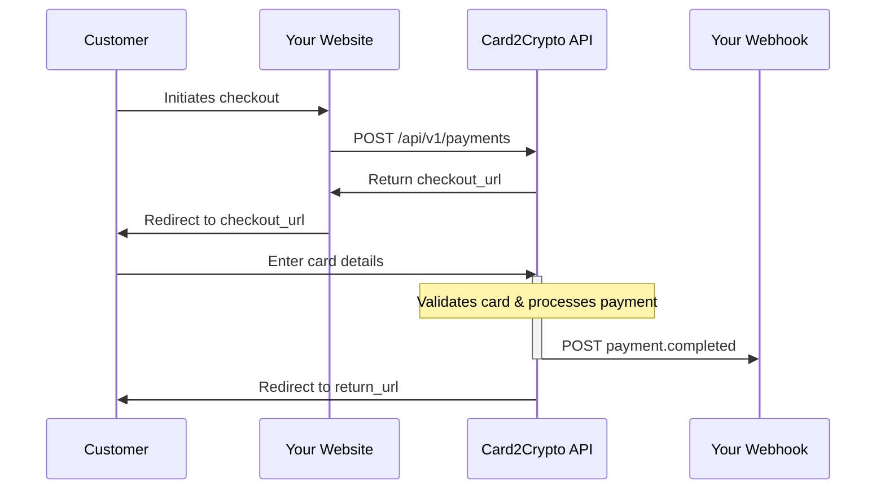

## Payment Flow

Here's how a typical payment flows through Card2Crypto:



## Payment Lifecycle

### 1. Pending

Payment is created but customer hasn't completed checkout yet.

```json
{
  "id": "pay_abc123",
  "status": "pending",
  "amount": 5000,
  "currency": "usd"
}
```

### 2. Processing

Customer submitted card details, payment is being processed.

### 3. Completed

Payment succeeded. Your balance is credited automatically.

```json
{
  "id": "pay_abc123",
  "status": "completed",
  "amount": 5000,
  "net_amount": 4250, // After 15% fee
  "completed_at": "2025-10-16T12:34:56Z"
}
```

### 4. Failed

Payment failed due to declined card, insufficient funds, etc.

```json
{
  "id": "pay_abc123",
  "status": "failed",
  "error": "card_declined"
}
```

## Payment Amounts

All amounts must be specified in **cents** (or smallest currency unit):

<CodeGroup>

```javascript Correct
{
  amount: 5000  // $50.00
}
```

```javascript Incorrect
{
  amount: 50.00  // This will be interpreted as $0.50!
}
```

</CodeGroup>

### Minimum Amount

The minimum payment amount is **$0.50 USD** (50 cents).

```javascript
{
  amount: 50  // Minimum allowed
}
```

### Maximum Amount

No maximum enforced by Card2Crypto, but Card2Crypto has per-transaction limits based on your account status.

## Currency Support

Currently, Card2Crypto only supports **USD** (United States Dollar).

```javascript
{
  currency: 'usd'  // Required
}
```

<Note>
Multi-currency support is planned for a future release. Stay tuned!
</Note>

## Customer Information

You can optionally include customer information:

```javascript
{
  amount: 5000,
  currency: 'usd',
  customer_email: 'customer@example.com',  // Optional
  customer_name: 'John Doe',               // Optional
  description: 'Order #1234'               // Optional
}
```

**Benefits of including customer info:**
- Better record keeping
- Automatic email receipts (coming soon)
- Fraud detection and chargeback protection
- Customer support resolution

## Metadata

Attach custom metadata to payments for your own tracking:

```javascript
{
  amount: 5000,
  currency: 'usd',
  metadata: {
    order_id: '1234',
    customer_id: 'cust_xyz',
    product_sku: 'WIDGET-001',
    affiliate_id: 'aff_123'
  }
}
```

Metadata is:
- Returned in webhook payloads
- Visible in your dashboard
- Limited to 16 key-value pairs
- Values must be strings

<Warning>
Do not include sensitive information (passwords, credit card numbers, etc.) in metadata.
</Warning>

## Redirect URLs

Control where customers are redirected after checkout:

```javascript
{
  amount: 5000,
  currency: 'usd',
  success_url: 'https://yoursite.com/thank-you',
  cancel_url: 'https://yoursite.com/cart'
}
```

### Success URL

Customer is redirected here after successful payment. Query parameters are appended:

```
https://yoursite.com/thank-you?payment_id=pay_abc123&status=completed
```

### Cancel URL

Customer is redirected here if they click "Cancel" or close the checkout page:

```
https://yoursite.com/cart?payment_id=pay_abc123&status=cancelled
```

<Tip>
Always verify payment status via webhooks, not just redirect URLs. Customers can manipulate URL parameters.
</Tip>

## Payment IDs

Every payment gets a unique identifier:

```
pay_a1b2c3d4e5f6g7h8
```

Use this ID to:
- Retrieve payment details via API
- Match webhook notifications to orders
- Provide customer support
- Reconcile your accounting

## 3D Secure (SCA)

Card2Crypto automatically handles 3D Secure authentication when required:

1. Customer enters card details
2. If 3DS required, modal appears for authentication
3. Customer completes authentication (fingerprint, SMS code, etc.)
4. Payment processes normally

No additional integration needed - it just works.

## Refunds

Refunds are processed manually by the Card2Crypto admin team.

To request a refund:
1. Contact support@card2crypto.cc
2. Provide the payment ID
3. State the refund reason

Refund timeline:
- Request reviewed within 24 hours
- If approved, processed within 2-3 business days
- Refund amount is deducted from your seller balance
- Customer receives refund to original payment method

<Note>
Automated refunds via API are planned for a future release.
</Note>

## Testing Payments

Use the [Payment Testing Tool](https://card2crypto.cc/test-payment) in your dashboard to create test payments.

<Warning>
All payments are live and real. There is no test mode. Use small amounts ($0.50-$1.00) for testing.
</Warning>

## Next Steps

<CardGroup cols={2}>
  <Card
    title="Create Payment API"
    icon="code"
    href="/api-reference/payments/create"
  >
    API reference for creating payments
  </Card>
  <Card
    title="Webhook Events"
    icon="webhook"
    href="/webhooks/events"
  >
    Learn about payment.completed and other events
  </Card>
</CardGroup>
