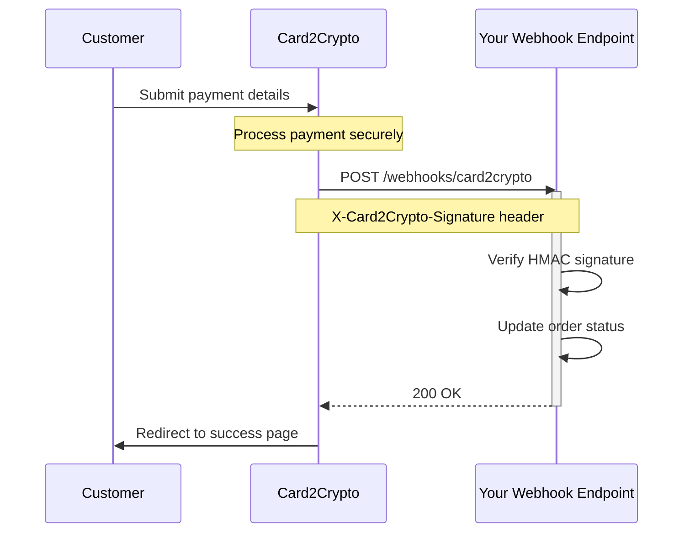

## What are Webhooks?

Webhooks are HTTP POST requests that Card2Crypto sends to your server when important events occur, such as when a payment is completed, fails, or is refunded.

Instead of repeatedly polling the API to check payment status, webhooks push notifications to you in real-time.

## Why Use Webhooks?

<CardGroup cols={2}>
  <Card title="Real-Time Updates" icon="bolt">
    Get instant notifications the moment a payment completes
  </Card>
  <Card title="Reliable" icon="shield-check">
    Automatic retries ensure you don't miss critical events
  </Card>
  <Card title="Efficient" icon="gauge-high">
    No need to poll the API - we push updates to you
  </Card>
  <Card title="Secure" icon="lock">
    HMAC signatures verify webhooks are authentic
  </Card>
</CardGroup>

## How Webhooks Work



## Setting Up Webhooks

### 1. Create an Endpoint

Create an HTTP endpoint on your server that accepts POST requests:

```javascript
// Example: https://yoursite.com/webhooks/card2crypto
app.post('/webhooks/card2crypto', (req, res) => {
  const event = req.body;

  // Process webhook
  console.log('Received event:', event.event);

  // Return 200 OK
  res.status(200).send('OK');
});
```

### 2. Configure in Dashboard

1. Go to [Dashboard > API Keys](https://card2crypto.cc/dashboard/shops)
2. Click on your shop settings
3. Enter your webhook URL
4. Copy your webhook secret
5. Save settings

<Tip>
Use the "Test Webhook" button to verify your endpoint is working correctly.
</Tip>

### 3. Verify Signatures

Always verify the webhook signature to ensure it's from Card2Crypto:

```javascript
const crypto = require('crypto');

function verifyWebhookSignature(payload, signature, secret) {
  const expectedSignature = crypto
    .createHmac('sha256', secret)
    .update(JSON.stringify(payload))
    .digest('hex');

  return signature === expectedSignature;
}
```

See [Webhook Security](/webhooks/security) for complete implementation.

## Webhook Events

Card2Crypto sends webhooks for these events:

| Event | Description |
|-------|-------------|
| `payment.completed` | Payment was successful |
| `payment.failed` | Payment failed |
| `payment.refunded` | Payment was refunded |

Learn more in [Webhook Events](/webhooks/events).

## Webhook Payload

All webhooks include:

```json
{
  "event": "payment.completed",
  "payment": {
    "id": "pay_abc123",
    "amount": 100.00,
    "currency": "usd",
    "status": "completed",
    "customer_email": "customer@example.com",
    "customer_name": "John Doe",
    "metadata": {
      "order_id": "1234"
    },
    "created_at": "2025-10-16T12:00:00Z",
    "completed_at": "2025-10-16T12:01:00Z"
  },
  "shop": {
    "id": "shop_xyz789",
    "shop_name": "My Store"
  },
  "timestamp": "2025-10-16T12:01:00Z"
}
```

## Retry Behavior

If your endpoint doesn't respond with `200 OK`, Card2Crypto automatically retries:

- **Retry 1:** After 2 seconds
- **Retry 2:** After 4 seconds
- **Retry 3:** After 8 seconds (final attempt)

After 3 failed attempts, the webhook is marked as failed and logged in your dashboard.

<Warning>
Your endpoint must respond within 10 seconds, or the request will timeout.
</Warning>

## Best Practices

<AccordionGroup>
  <Accordion title="Return 200 OK Quickly">
    Process webhooks asynchronously. Return `200 OK` immediately, then handle the event in the background.

    **Good:**
    ```javascript
    app.post('/webhooks/card2crypto', (req, res) => {
      // Return 200 immediately
      res.status(200).send('OK');

      // Process async
      processWebhook(req.body);
    });
    ```

    **Bad:**
    ```javascript
    app.post('/webhooks/card2crypto', async (req, res) => {
      // Don't do slow operations before responding
      await sendEmail(req.body.payment.customer_email);
      await updateDatabase(req.body.payment.id);

      res.status(200).send('OK'); // Too late!
    });
    ```
  </Accordion>

  <Accordion title="Handle Duplicates">
    You might receive the same webhook multiple times. Implement idempotency:

    ```javascript
    async function processWebhook(event) {
      const paymentId = event.payment.id;

      // Check if already processed
      const existing = await db.webhooks.findOne({ paymentId });
      if (existing) {
        console.log('Webhook already processed');
        return;
      }

      // Process webhook
      await db.orders.update({
        where: { id: event.payment.metadata.order_id },
        data: { status: 'paid' }
      });

      // Mark as processed
      await db.webhooks.create({ paymentId, processedAt: new Date() });
    }
    ```
  </Accordion>

  <Accordion title="Log Everything">
    Keep detailed logs of all webhooks for debugging:

    ```javascript
    app.post('/webhooks/card2crypto', (req, res) => {
      console.log('[Webhook] Received:', {
        event: req.body.event,
        payment_id: req.body.payment.id,
        signature: req.headers['x-card2crypto-signature'],
        timestamp: new Date().toISOString()
      });

      // Process...

      res.status(200).send('OK');
    });
    ```
  </Accordion>

  <Accordion title="Monitor Failures">
    Check your [Dashboard > Webhook Logs](https://card2crypto.cc/dashboard/webhooks) regularly for failed deliveries.
  </Accordion>
</AccordionGroup>

## Testing Webhooks

### Local Development

Use tools like [ngrok](https://ngrok.com) to expose your local server:

```bash
# Start ngrok
ngrok http 3000

# Use the ngrok URL in dashboard
https://abc123.ngrok.io/webhooks/card2crypto
```

### Test Webhook Button

Use the "Test Webhook" button in your shop settings to send a test event:

```json
{
  "event": "payment.completed",
  "payment": {
    "id": "test_payment_1729123456789",
    "amount": 10.00,
    "currency": "usd",
    "status": "completed",
    "customer_email": "test@example.com",
    "customer_name": "Test Customer",
    "metadata": {
      "description": "Test payment for webhook verification"
    },
    "created_at": "2025-10-16T12:00:00Z",
    "completed_at": "2025-10-16T12:00:00Z"
  },
  "shop": {
    "id": "your_shop_id",
    "shop_name": "Your Shop Name"
  },
  "timestamp": "2025-10-16T12:00:00Z"
}
```

## Troubleshooting

<AccordionGroup>
  <Accordion title="Webhooks not arriving">
    **Check:**
    - Is your webhook URL correct and publicly accessible?
    - Is your server running and accepting POST requests?
    - Check your firewall settings
    - Look for errors in [Dashboard > Webhook Logs](https://card2crypto.cc/dashboard/webhooks)
  </Accordion>

  <Accordion title="Signature verification fails">
    **Check:**
    - Are you using the correct webhook secret?
    - Are you JSON.stringify-ing the payload exactly as received?
    - Are you using HMAC-SHA256 (not SHA256)?
    - Check for middleware that modifies req.body
  </Accordion>

  <Accordion title="Webhooks timing out">
    **Fix:**
    - Return 200 OK immediately
    - Process webhooks asynchronously
    - Optimize slow database queries
    - Remove external API calls from webhook handler
  </Accordion>
</AccordionGroup>

## Next Steps

<CardGroup cols={2}>
  <Card
    title="Webhook Security"
    icon="shield-check"
    href="/webhooks/security"
  >
    Learn how to verify webhook signatures
  </Card>
  <Card
    title="Webhook Events"
    icon="list"
    href="/webhooks/events"
  >
    Complete list of webhook event types
  </Card>
</CardGroup>
